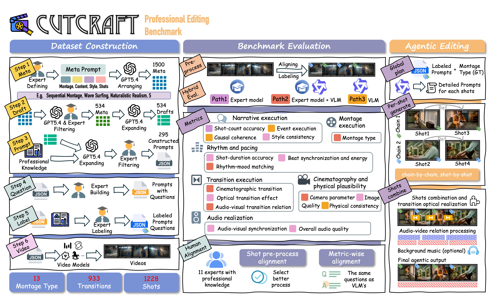

<h1 align="center"> Beyond Coherence: Benchmarking Professional Editing-Technique Execution in Multi-Shot Audio-Video Generation
</h1>

<div align="center">

[](https://arxiv.org/abs/2609.08275)&nbsp;[](https://huggingface.co/datasets/ZTY01/CutCraft)


Tianyi Zeng $^{2}$, Junchao Liao $^{1}$, Yujie Wei $^{3}$, Ziying Zhang $^{1}$, Litao Li $^{1}$, Tianyi Wang $^{4}$, 
Zhichao Wei $^{1}$, Wenwen Qiang $^{5}$, Siyu Zhu $^{3}$, Shuyao Xu $^{1}$, Zhenghao Zhang $^{1\dagger ✉}$, Long Qin $^{1}$

$^{1}$ Alibaba Group, $^{2}$ Shanghai Jiao Tong University, $^{3}$ Fudan University, $^{4}$ UT Austin,
$^{5}$ Institute of Software, Chinese Academy of Sciences

($\dagger$) project leader, (✉) corresponding author

</div>

<p align="center">
  
</p>

## Overview

Recent multi-shot audio-video generators can produce coherent and cinematic outputs, but visual
coherence alone does not show whether a model can execute professional editing intent. CutCraft
studies this gap through two complementary components:

- **CutCraft Benchmark** — evaluates shot structure, transition grammar, audio-video cut
  relations, montage, and other editing-oriented dimensions using expert models and multimodal
  judgment.
- **Agentic Editing Baseline** — decomposes generation into planning, shot-level synthesis,
  composition, rolling evaluation, and optional repair to explicitly realize editing operations
  such as J-cuts, L-cuts, and transition timing.

The benchmark combines structured multi-shot prompts with explicit editing specifications and a
hierarchical hybrid evaluation framework. The current implementation evaluates 16 dimensions
(A1–A4, B1–B3, C1, D1–D3, E1–E3, F1–F2) through three complementary modes:

| Mode | Evaluation strategy |
|---|---|
| **Mode A** | Direct expert-model computation |
| **Mode B** | Tool-grounded VLM judgment over expert evidence |
| **Mode C** | Rubric-based multimodal question answering |

Across 13 state-of-the-art closed- and open-source models, CutCraft reveals a persistent gap
between coherence and editability: plausible multi-shot videos frequently exhibit unstable shot
structure, weak control of audio-video asynchrony, and substantial degradation on higher-order
montage instructions.

## Abstract

Recent multi-shot audio-video generators can produce increasingly coherent and cinematic outputs,
but coherence does not imply the ability to follow editing intent. Professional editing depends on
shot structure, transition grammar, audio-video cut relations, and montage, yet existing benchmarks
largely rely on proxies such as content quality, synchronization, or physical plausibility,
systematically missing whether such editorial instructions are actually executed. We introduce
**CutCraft**, the first benchmark for editing intent in multi-shot audio-video generation.
CutCraft extends structured multi-shot prompts with explicit editing specifications and is paired
with a hierarchical hybrid evaluation framework that combines shot-structure alignment,
expert-model metrics, tool-grounded multimodal judgment, and rubric-based question answering.
Beyond evaluation, we design an agentic editing baseline that decomposes generation into planning,
shot-level synthesis, and post-hoc composition, explicitly realizing editing semantics such as
J-cuts, L-cuts, and transition timing. Across 13 state-of-the-art closed- and open-source models,
CutCraft reveals a consistent gap between coherence and editability: current systems often
produce plausible multi-shot videos yet fail to execute editorial instructions reliably. We find
unstable shot structures, weak control of audio-video asynchrony, and sharp degradation on
higher-order montage, while aesthetic quality is only weakly correlated with editing-intent
compliance.

## Repository Structure

```text
CutCraft/
├── agentic_edit_baseline/      # generation, rolling evaluation, and repair agent
├── benchmark/                  # three-pathway benchmark and resumable watchdog runner
├── figures/                    # paper and repository figures
├── prompt/                     # prompts and question banks (English and Chinese)
├── requirements/
│   └── CutCraft.txt          # direct dependencies for the shared environment
├── third_party/                # expert-model microservices and weight downloader
└── videos/                     # evaluation videos, grouped by model name
```

Detailed documentation:

- [Benchmark guide](benchmark/README.md)
- [Agentic editing baseline guide](agentic_edit_baseline/README.md)
- [Expert services and model weights](third_party/README.md)

## Installation

### 1. Create the environment

All benchmark scripts, agent code, media tools, and expert services share one Python 3.10 conda
environment.

```bash
conda create -n CutCraft python=3.10 -y
conda activate CutCraft
conda install -c conda-forge ffmpeg -y
pip install -r requirements/CutCraft.txt
```

The default requirements use PyTorch `1.12.1+cu113`. If your CUDA runtime is different, adjust the
`torch`, `torchvision`, and `torchaudio` versions and the PyTorch wheel index in
`requirements/CutCraft.txt`.

### 2. Configure executable paths

After activating the environment,
the following defaults usually work; explicit overrides are useful on shared servers:

```bash
CutCraft_BIN="$(conda run -n CutCraft printenv CONDA_PREFIX)/bin"

export EVAL_PYTHON="$CutCraft_BIN/python"
export EXPERT_SERVICE_PYTHON="$CutCraft_BIN/python"
export EDIT_AGENT_PYTHON="$CutCraft_BIN/python"
export AGENT_EVAL_PYTHON="$CutCraft_BIN/python"
export AV_PROCESS_BIN="$CutCraft_BIN"
```

### 3. Configure the API key

The VLM/LLM evaluation use an OpenAI-compatible DashScope API:

```bash
export DASHSCOPE_API_KEY=sk-xxxx
```

Never commit API keys to the repository.

## Expert Model Weights

Expert-model weights are not installed by pip and are ignored by Git. Download all directly
fetchable weights from the repository root with:

```bash
bash third_party/download_weights.sh
```

The script downloads files to the exact paths expected by the microservices, skips non-empty files
already present, and can be safely re-run after an interrupted download. Some components require a
manual upstream-repository or tool-managed step (including MonST3R, TransNetV2, and 6DRepNet); the
script prints these steps when it finishes.

See [third_party/README.md](third_party/README.md#downloading-the-weights) for the complete weight
layout, equivalent per-file commands, optional weights, and legacy components. In particular,
`dnsmos` (8008) and `u2net` (8011) do not use learned weights.

## Preparing Evaluation Videos

The test videos in the paper are available on Hugging Face:
[ZTY01/CutCraft](https://huggingface.co/datasets/ZTY01/CutCraft). Each model has its own
subdirectory inside the repository; you can download them and place the folders directly under
`videos/` to reproduce the reported results.

Place generated videos under `videos/`, with one subdirectory per model. Each subdirectory name
must exactly match an entry in the `MODELS` array of
`benchmark/run_model_sequence_with_watchdog.sh`.

```text
videos/
├── wan2.7/
│   ├── XXXX.mp4
│   └── ...
├── MiniMax-H3/
│   └── ...
└── <model-name>/
    └── ...
```

Only `.mp4` files are collected by the main runner. The leading integer in each filename is the
video ID used to join the video with `prompt/prompt.json` and `prompt/question_bank.json`; keep IDs

The default template is `<repo>/videos/{model}`. For videos stored elsewhere, override it without
editing source files:

```bash
export EVAL_VIDEO_DIR_TEMPLATE=/mnt/data/videos/{model}
```

## Running the Benchmark

The recommended entry point is the resumable multi-model watchdog. It validates prompt and video
paths, starts the 14 active expert services, evaluates each configured model, restarts failed
services, and writes results under `logs/`.

1. Edit the `MODELS=(...)` array near the top of
   `benchmark/run_model_sequence_with_watchdog.sh` so that it matches the subdirectories under
   `videos/`.
2. Adjust the `SERVICES` GPU assignments in that script for your machine if necessary. Each entry
   uses the format `service="port:gpu_id"`.
3. Run from the repository root:

```bash
export DASHSCOPE_API_KEY=sk-xxxx

bash benchmark/run_model_sequence_with_watchdog.sh
bash benchmark/run_model_sequence_with_watchdog.sh --range 1-10
bash benchmark/run_model_sequence_with_watchdog.sh --ids 103 204 313
```

Results are written to:

```text
logs/<EVAL_RESULT_BASE>/<model>/
```

`EVAL_RESULT_BASE` defaults to `final`. The evaluator supports prompt-ID filtering, index ranges,
resume files, completed-model skipping, service health monitoring, and configurable external video
or log roots. See the [benchmark guide](benchmark/README.md) for environment overrides,
single-model execution, aggregation details, and the service-port table.

## Running the Agentic Editing Baseline

The baseline shares a six-stage generation core:

```text
shot segmentation
  → cross-shot consistency and narrative anchoring
  → per-shot prompt rewriting
  → generation planning
  → shot generation (t2v / i2v / r2v)
  → ffmpeg transition composition and audio mixing
```

### Pure generation

```bash
cd agentic_edit_baseline
export DASHSCOPE_API_KEY=sk-xxxx

bash run_baseline.sh --id 1
bash run_baseline.sh --first-n 3
bash run_baseline.sh --ids "1,2,5"
bash run_baseline.sh --id 1 --dry-run
```

### Generation with rolling evaluation and repair

Start the isolated self-evaluation services on ports 8101/8104/8105/8107, then launch the agent:

```bash
cd agentic_edit_baseline
export DASHSCOPE_API_KEY=sk-xxxx

bash agent_eval/start_agent_services.sh start
bash run_agent.sh --id 1 --max-repair-rounds 2

# when finished
bash agent_eval/start_agent_services.sh stop
```

The agent adds rolling B1/D2/D3 evaluation and central-planner repair to the generation pipeline.
If its self-evaluation services are unavailable, it degrades to pure generation. Configuration,
model IDs, audio policies, output paths, and repair thresholds live in
`agentic_edit_baseline/config.yaml`; see the
[agentic baseline guide](agentic_edit_baseline/README.md) for all options and output layouts.

## Benchmark Inputs and Outputs

| Resource | Purpose |
|---|---|
| `prompt/prompt.json` | Structured multi-shot prompts and editing specifications |
| `prompt/question_bank.json` | Mode C rubric questions keyed by video ID |
| `prompt/prompt_zh.json` | Chinese prompt variant |
| `prompt/question_bank_zh.json` | Chinese question-bank variant |
| `videos/<model>/*.mp4` | Generated videos under evaluation |
| `logs/<result-base>/<model>/` | Per-model scores, resumable state, and reports |


## Citation
```bibtex
@article{zeng2026beyond,
  title={Beyond Coherence: Benchmarking Professional Editing-Technique Execution in Multi-Shot Audio-Video Generation},
  author={Zeng, Tianyi and Liao, Junchao and Wei, Yujie and Zhang, Ziying and Li, Litao and Wang, Tianyi and Wei, Zhichao and Xu, Shuyao and Qiang, Wenwen and Zhu, Siyu and Zhang, Zhenghao and Qin, Long},
  journal={arXiv preprint arXiv:2609.08275},
  year={2026}
}
```
